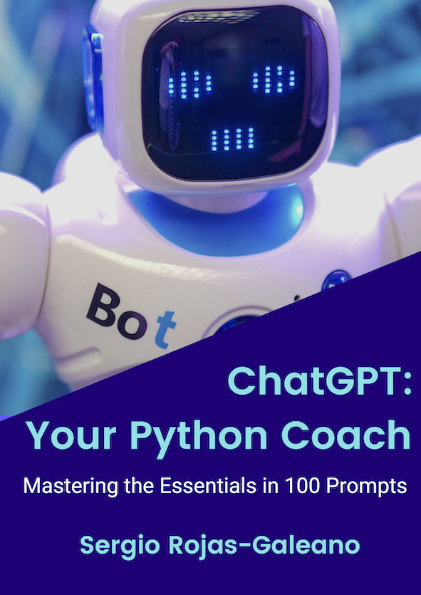

# ChatGPT: Your Python Coach. 
## Mastering the Essentials in 100 Prompts.

Welcome to the companion site for "ChatGPT: Your Python Coach" by Sergio Rojas-Galeano. 

Get ready to embark on an exhilarating journey into the world of programming and let ChatGPT be your reliable mentor along the way. With its content generation capabilities, ChatGPT will assist you with examples, explanations, and feedback, making your learning experience interactive and engaging.

The guide has been carefully conceived and curated to help you navigate the fundamentals of Python programming effortlessly. From variables and data types to conditionals, loops, containers like lists and dictionaries, and modularisation techniques like functions and classes, you'll master the basics of this popular language. 

Inside this repository, you'll find a collection of Jupyter Notebooks featuring the Python code examples from the book. They are conveniently organized by chapter in the \textit{code} folder.

Get ready to tackle exciting challenges that put your newfound skills to the test. Happy coding!
